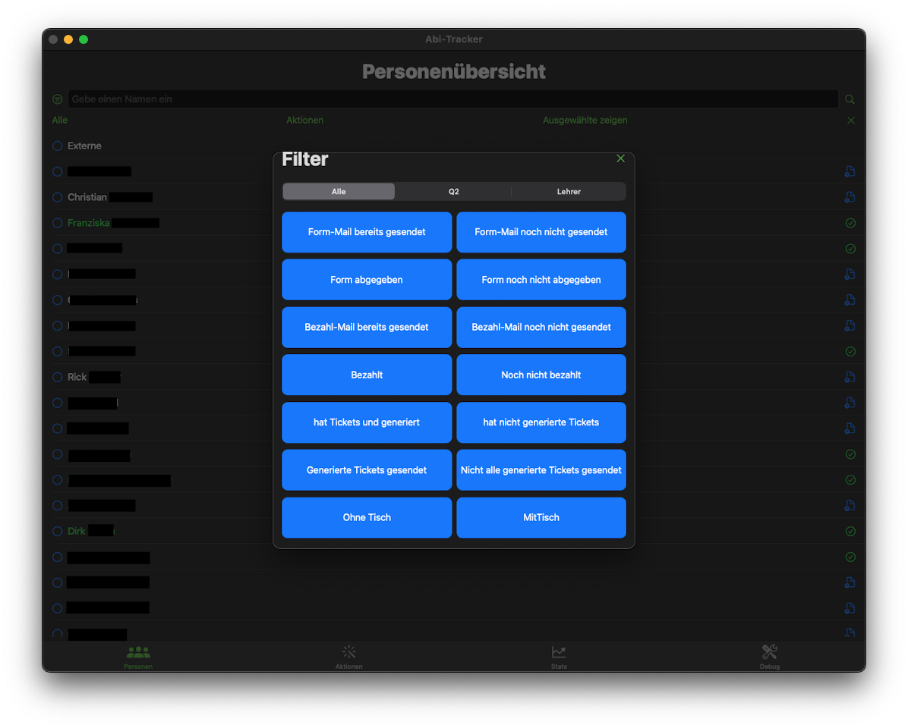

# Verwaltungstool
### Für den Abitur-Jahrgang 2023

- 1275 versendete E-Mails
- 882 digitale Tickets
- 6 Scanner mit in Echtzeit synchronisierten Ticketdaten
- 200 Überweisungen

> alles automatisiert verwaltet

## Ticket

## Statistiken

## E-Mails

## Ticket Scanner

## Verwaltung

